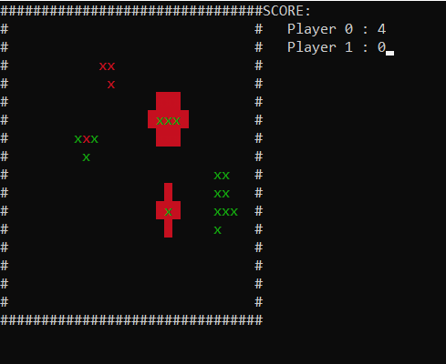

# Игра Точки
Task по курсу Python

Окружайте противников чтобы захватить всё поле!

### Запуск
Запустите dots.py, передав через пробелы ширину и длину поля.
При запуске без параметров размеры поля будут установлены 20х20.

Приятной игры

